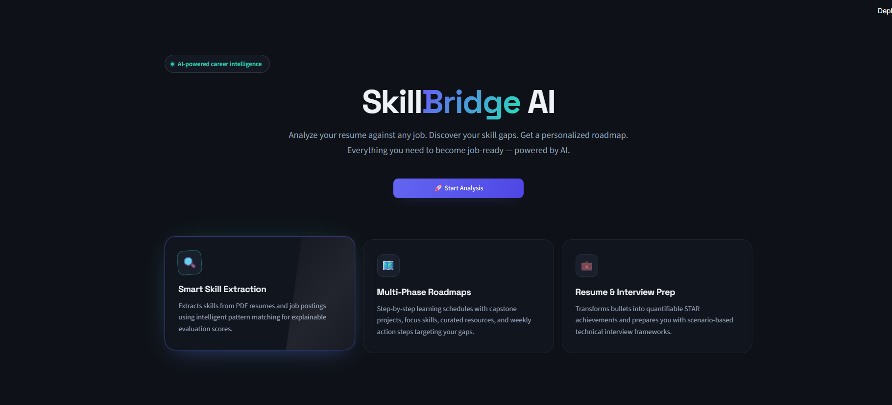
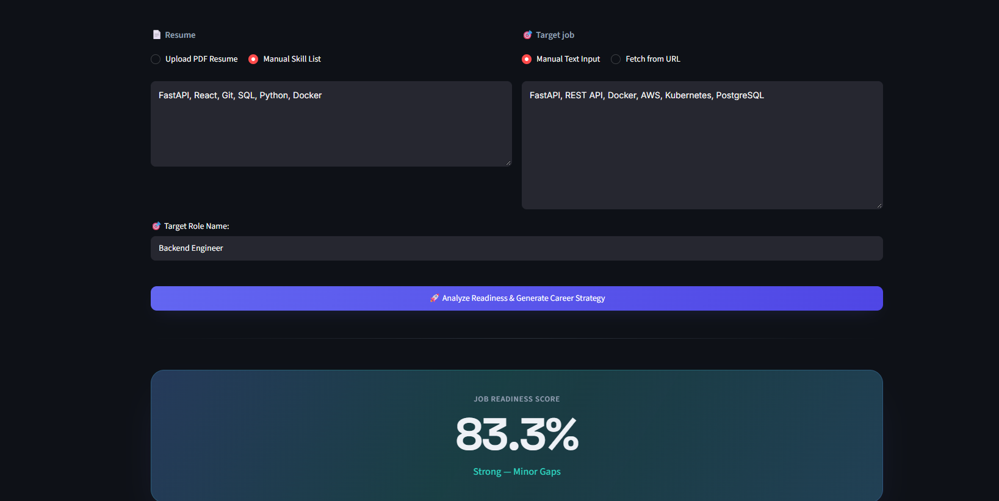
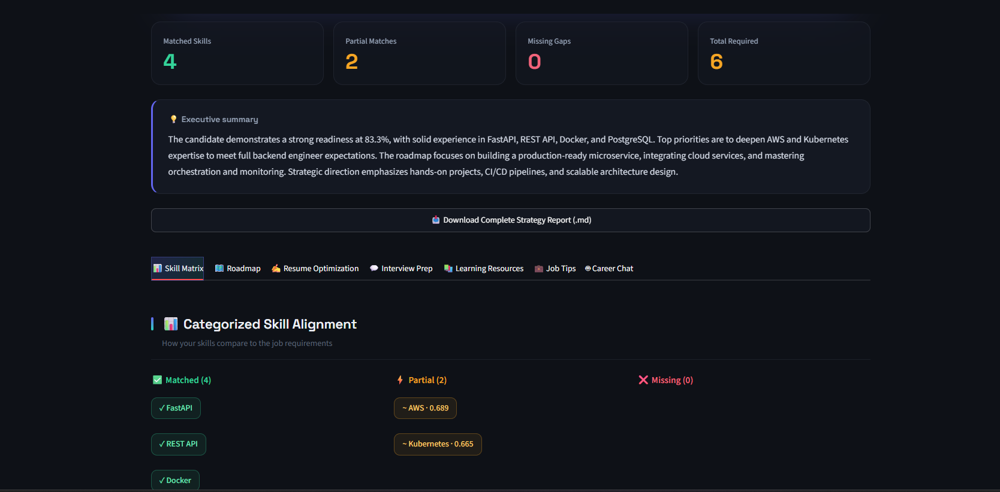
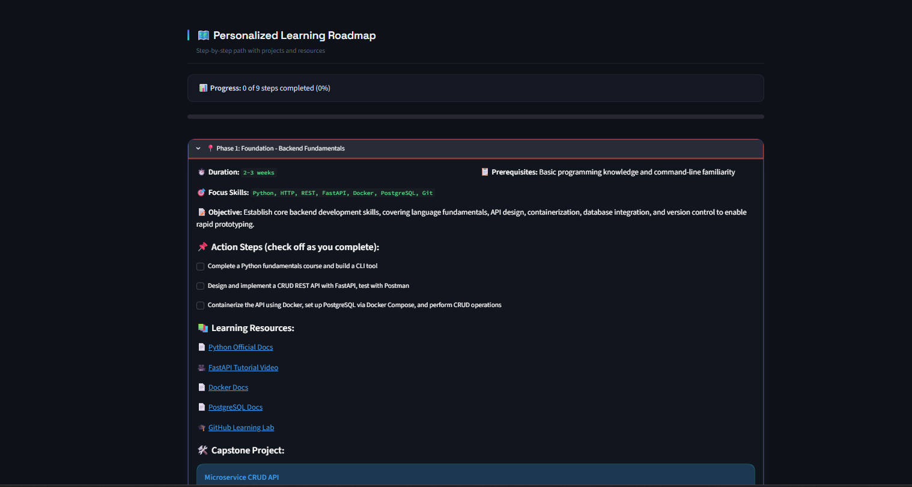
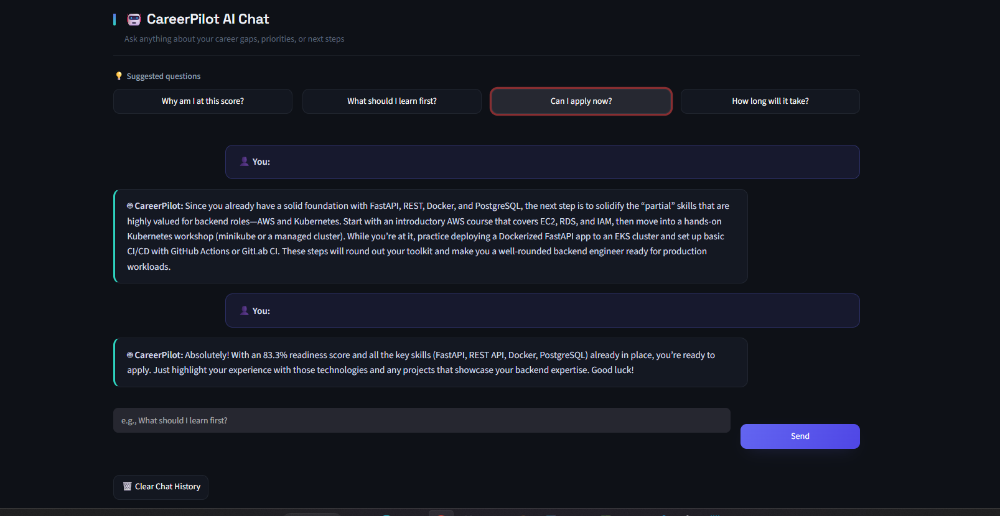

# ⚡ SkillBridge AI

**AI-Powered Career Intelligence & Job-Readiness Platform**

Analyze your resume against any job. Discover your skill gaps. Get a personalized career roadmap. Everything you need to become job-ready — powered by AI.


---

## 🎯 Overview

SkillBridge AI is an AI-powered career intelligence platform that solves a common problem faced by students and job seekers: **they know what skills they have, but don't know what's missing or what to learn next.**

The system takes a user's resume and a target job description, then:

- 🔍 **Extracts skills** using a curated taxonomy + regex patterns
- 🧠 **Matches skills semantically** using sentence-transformer embeddings
- 📊 **Calculates explainable readiness scores** with matched/partial/missing breakdown
- 🗺️ **Generates personalized roadmaps** with phases, projects, and learning resources
- ✍️ **Provides resume optimizations** with before/after rewrites
- 💬 **Offers AI career chat** for questions about the user's specific gaps

---

## 🏗️ Architecture

```
┌─────────────────────────────────────────────────────────────┐
│                        USER                                 │
└──────────────────────┬──────────────────────────────────────┘
                       │
                       ▼
            ┌──────────────────────┐
            │  Streamlit Frontend  │
            │   (Premium UI)       │
            └──────────┬───────────┘
                       │
                       ▼
            ┌──────────────────────┐
            │   FastAPI Backend    │
            └──────────┬───────────┘
                       │
       ┌───────────────┼───────────────┐
       ▼               ▼               ▼
┌─────────────┐ ┌─────────────┐ ┌─────────────┐
│   Skill     │ │  Embedding  │ │  Groq LLM   │
│  Extractor  │ │   Matcher   │ │  (2-call)   │
└─────────────┘ └─────────────┘ └─────────────┘
       │               │               │
       └───────────────┼───────────────┘
                       ▼
              ┌─────────────────┐
              │  Career Chat    │
              │   (RAG-style)   │
              └─────────────────┘
```

---

## 🛠️ Tech Stack

| Layer | Technology |
|-------|------------|
| **Frontend** | Streamlit (custom CSS) |
| **Backend** | FastAPI + Uvicorn |
| **LLM** | Groq API (Llama 3.3 70B via `openai/gpt-oss-20b`) |
| **Embeddings** | Sentence Transformers (`all-MiniLM-L6-v2`) |
| **NLP** | Custom taxonomy + regex extraction |
| **Web Scraping** | BeautifulSoup + Requests |
| **PDF Parsing** | pdfplumber |
| **Data** | Custom `skill_taxonomy.json` |

---

## 📁 Project Structure

```
skillbridge-ai/
├── src/
│   ├── api/              # FastAPI backend
│   │   └── main.py       # 3 endpoints: /health, /analyze, /chat
│   ├── ai/               # AI modules
│   │   ├── advice_generator.py   # 2-call Groq pipeline
│   │   └── chatbot.py            # Career chatbot
│   ├── frontend/         # Streamlit UI
│   │   └── app.py        # Main app with 7 tabs
│   ├── matching/         # Skill matching
│   │   ├── embedding_matcher.py  # Semantic matcher
│   │   ├── scoring_engine.py     # Readiness score
│   │   └── skill_extractor.py    # Taxonomy extraction
│   ├── extractors/       # PDF + job parsing
│   └── utils/            # Web scraping
├── data/
│   ├── skill_taxonomy.json       # Curated skills
│   └── knowledge/                # (optional) knowledge base
├── config/
├── requirements.txt
├── .env.example
├── .gitignore
└── README.md
```

---

## 🚀 Quick Start

### Prerequisites

- Python 3.10 or higher
- Groq API key (free at https://console.groq.com)

### Installation

**1. Clone the repository:**
```bash
git clone https://github.com/Tahirahmad1002/skillbridge-ai.git
cd skillbridge-ai
```

**2. Create virtual environment:**
```bash
python -m venv .venv

# Windows:
.venv\Scripts\activate

# Mac/Linux:
source .venv/bin/activate
```

**3. Install dependencies:**
```bash
pip install -r requirements.txt
```

**4. Configure environment variables:**

Create a `.env` file in the project root:
```env
GROQ_API_KEY=your_groq_api_key_here
API_URL=http://127.0.0.1:8000/api/v1/analyze
```

### Running the Application

**Terminal 1 — Backend:**
```bash
uvicorn src.api.main:app --reload
```
Wait for `Application startup complete` message.

**Terminal 2 — Frontend:**
```bash
streamlit run src/frontend/app.py
```

Open browser at **http://localhost:8501**

---

## 💡 How It Works

### 1. Skill Extraction

The system uses a curated **skill taxonomy** (`data/skill_taxonomy.json`) with 100+ real skills across categories:
- Programming languages
- Frameworks & libraries
- Databases
- Cloud & DevOps
- Concepts & methods

Text is processed with regex + word boundaries to extract only real skills — filtering out noise.

### 2. Semantic Matching

Instead of simple keyword matching, skills are encoded as **384-dimensional vectors** using `sentence-transformers/all-MiniLM-L6-v2`:
- Context wrapper: `"Professional skill: {X}. A technology used in software development."`
- Cosine similarity for semantic comparison
- **Curated equivalence map**: fixes known equivalent pairs (e.g., `PostgreSQL ↔ SQL`)
- **Exclusion map**: prevents false positives (e.g., `Docker ↔ Git`)

### 3. Readiness Score

```
Matched Skill × 1.0    = Full credit
Partial Match × 0.5    = Half credit
Missing Skill × 0.0    = No credit
────────────────────────────────────
Score = (weighted sum) / (total skills) × 100
```

### 4. AI Career Advice

Two separate LLM calls for reliability:
- **Call 1:** Roadmap phases + learning resources
- **Call 2:** Resume optimizations + interview prep

If either call fails, a **dynamic fallback** fills missing sections using the user's actual gap data.

### 5. Career Chatbot

The chatbot receives the user's **full analysis context** (score, matched, missing skills, target role) in every prompt, ensuring personalized responses.

---

## 📊 API Endpoints

| Method | Endpoint | Purpose |
|--------|----------|---------|
| `GET` | `/health` | Health check |
| `POST` | `/api/v1/analyze` | Analyze resume vs job |
| `POST` | `/api/v1/chat` | Career chatbot |

Full API docs available at **http://127.0.0.1:8000/docs** after starting the backend.

---

## 🔬 Technical Highlights

- **Semantic embeddings** with context wrapper for skill disambiguation
- **Curated equivalence + exclusion maps** for domain-specific accuracy
- **Two-call LLM architecture** to bypass token limit issues
- **Guaranteed content** through validation + fallback system
- **RAG-style chatbot** with user-profile injection
- **Premium UI** with custom CSS, animations, and hover effects
- **Full-document support** — parses paragraphs, not just comma-separated skills

---

## 📸 Screenshots

### 🏠 Landing Page



### 📊 Readiness Score & Executive Summary



### 🔍 Skill Matrix — Matched, Partial & Missing



### 🗺️ Personalized Learning Roadmap



### ✍️ Resume Optimization (Before / After)


### 🤖 CareerPilot AI Chat



---

## 🧪 Evaluation Example

**Input:**
- Resume: `Python, FastAPI, SQL, Git, JavaScript`
- Job: Paragraph description of a Backend Engineer role
- Target Role: `Backend Engineer`

**Output:**
- Readiness Score: **80.0%**
- Matched: FastAPI, Flask, MySQL, PostgreSQL, Python, REST API, React, TypeScript
- Missing: AWS, Docker
- Full roadmap for AWS + Docker with projects, resources, and interview prep

---

## 🚧 Roadmap

- [x] Core skill matching + scoring
- [x] Semantic embedding matcher
- [x] Groq LLM advice generation
- [x] Career chatbot
- [x] Full job-description parsing
- [ ] RAG knowledge base
- [ ] LangGraph workflow
- [ ] PDF report export
- [ ] Interview simulation
- [ ] Multi-language support

---

## 📄 License

MIT License — free to use, modify, and distribute.

---

## 🙏 Acknowledgements

- Built as part of the **ATS Applied Training 2026**
- Pre-trained model: [sentence-transformers/all-MiniLM-L6-v2](https://huggingface.co/sentence-transformers/all-MiniLM-L6-v2)
- LLM: [Groq](https://console.groq.com)

---

**Built with ❤️ by [Tahir Ahmad](https://github.com/Tahirahmad1002)**
